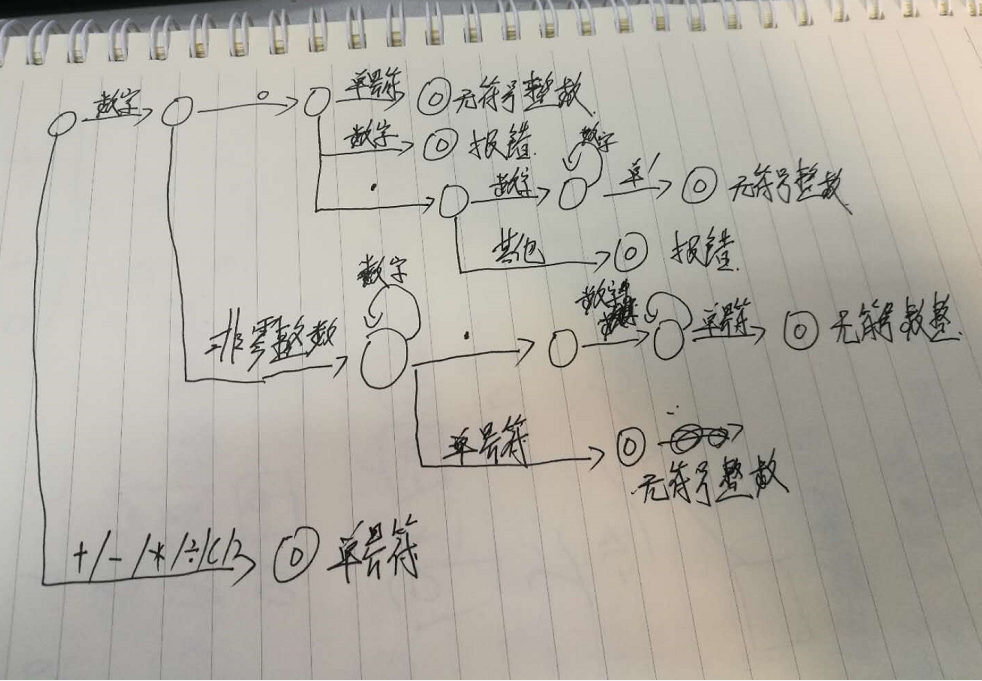

# Compiling-principle-experiment
编译原理实验，C/C++

DFA: 原理图

项目的LR0分析表
文法G[S]：
    (1)	S’->•S
    (2)	S->•X+S
    (3)	S->•X-S
    (4)	S->•X
    (5)	X->•Y*X
    (6)	X->•Y/X
    (7)	X->•Y
    (8)	Y->•i
    (9)	y->-•Y
    (10)y->(X)

项目演示：
输入10/((1.56-4)+0*-4+0.0000)

运行方法：
在windows,linux,MacOS,可在命令行里使用G++编译运行，亦可使用Visual Studio等IDE

提示：由于时间关系，这个版本代码有很多问题，之后会更新。